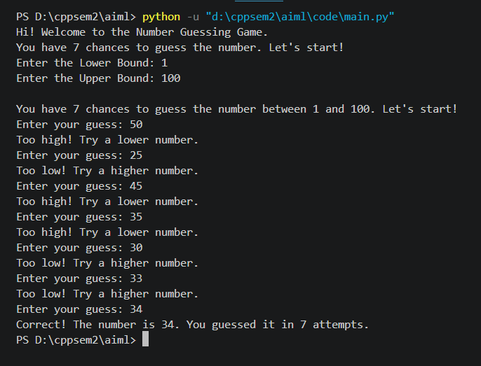

# Number-Guessing-Game

---

<b>This is a game where the user is asked to input upper and lower limit then user have 7 guess to get the correct number by guessing it.</b>

---

## How to Run : 
Follow these steps to get the project running on your local machine:

### 1. Prerequisites
Ensure you have Python installed. You will also need to install the following libraries:
      pip install tensorflow numpy matplotlib

### 2. Clone the Repository:
Next clone this repo to use 

     git clone https://github.com/Rishabh-Tripathy/number-guessing-game

### 3. Navigate to the Code Directory
change the directory to :

     cd code

### 4.Execute the Script :
Run the main Python file:

      python main.py

---

## Results/Screenshots: 
  Here is the look of how it looks after running . 
 

---

## ⚖️ License & Copyright

Copyright (c) 2026 Rishabh Tripathy

This project is licensed under the **MIT License**.  
You are free to use, copy, and modify this resource for educational purposes, provided that attribution is given to the original author.

> [!NOTE]
> All content and infographics created are for education purposes. Please credit the author if you share these resources with other batches.